# Домашнее задание по linux

1. Устанавливаю и запускаю 3 виртуальные машины в Virtual Box:
Ubuntu_A, Ubuntu_B, Ubuntu_C

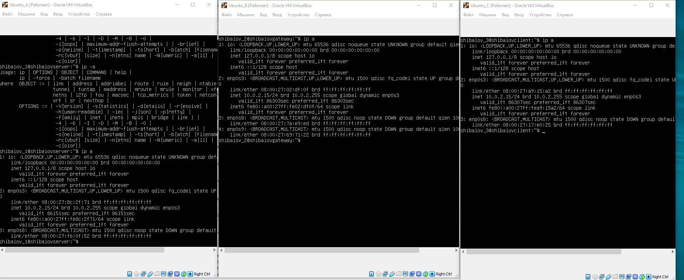


2. Для каждой виртуальной машины переименовываю hostname в соответственно shibalovserver, shibalovgateway и shibalovclient, создавая так же пользователей shibalov_1, shibalov_2, shibalov_3. 

```shell 
$ sudo vim /etc/hostname 
```

```shell 
$ sudo adduser shibalov_1 
```

3. На каждой машине устанавливаю ssh командами:

```shell
$ sudo apt update
```

Установка ssh:

```shell
$ sudo apt-get install ssh
```

Установка OpenSSH

```shell
$ sudo apt install openssh-server
```

Добавим пакет SSH-сервера в автозагрузку


```shell
$ sudo systemctl enable sshd
$ apt install openssh-server -y
$ systemctl enable ssh
$ systemctl start ssh
$ system status ssh
```

4. Также я пробросил порты для ssh на каждой виртуальной машине

- ```shibalov_1 : 1001```

- ```shibalov_2 : 1002```

- ```shibalov_3 : 1003```

5. Пытаюсь подключиться с терминала ко второй машине через ssh:

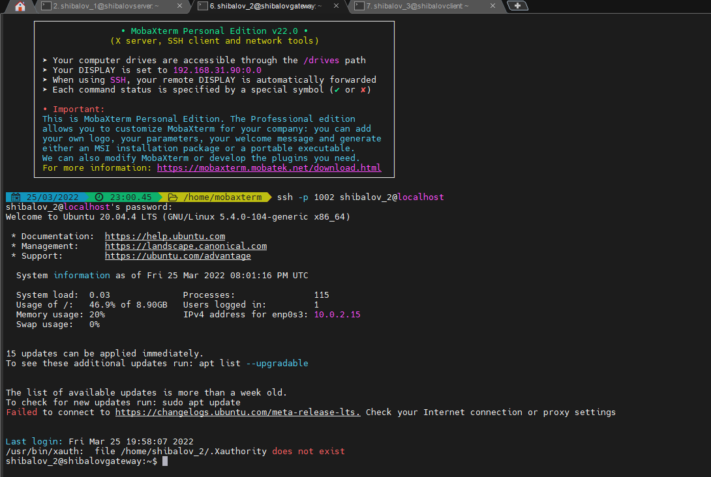

6. На виртуальной машине shibalov_server меняю конфигурацию netplan:

Открою файл конфигурации
```shell
$ sudo vim /etc/netplan/00-installer-config.yaml
```
и добавлю enp0s8:
```yaml
network:
  ethernets:
    enp0s3:
      dhcp4: true
    enp0s8:
      dhcp4: false
      addresses: [192.168.13.10/24]
      gateway4: 192.168.13.1
  version: 2
```

После каждого изменения конфигурации в .yaml файле делаю следующие шаги:

Проверяю синтаксис на корректность:
```shell
$ sudo netplan --debug generate
```
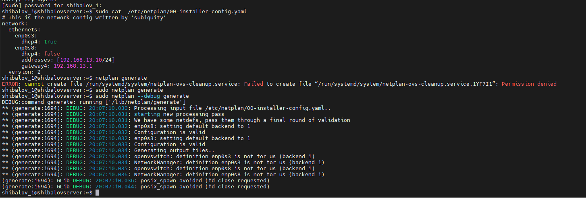

Применяю конфигурацию:
```shell
$ sudo netplan apply
```

Теперь тоже самое для shibalov_gateway:
```yaml
network:
  ethernets:
    enp0s3:
      dhcp4: true
    enp0s8:
      dhcp4: false
      addresses: [192.168.13.1/24]
    enp0s9:
      dhcp4: false
      addresses: [192.168.8.1/24]
  version: 2
```

И для shibalov_client:
```yaml
network:
  ethernets:
    enp0s3:
      dhcp4: true
    enp0s8:
      dhcp4: false
      addresses: [192.168.8.100/24]
      gateway4: 192.168.8.1
  version: 2
```

7. С сервера пропингуем шлюз и клиента:
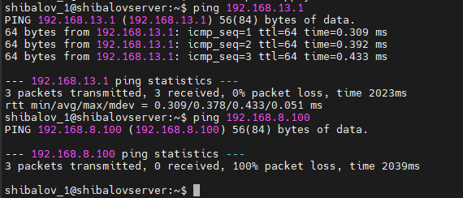

От шлюза ответ есть, а вот от клиента нема

8. Свяжем интерфейсы enp0s8 и enp0s9 на шлюзе
```shell
$ sudo echo 1 | sudo tee /proc/sys/net/ipv4/ip_forward 1
```
Пропингуем клиента:

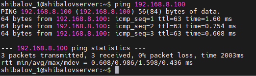

Отлично, все работает

9. Для сохранения настроек видимости откроем файл 
```shell
$  sudo vim /etc/sysctl.conf 
```
И раскоментим строку
```#net.ipv4.ip_forward=1```

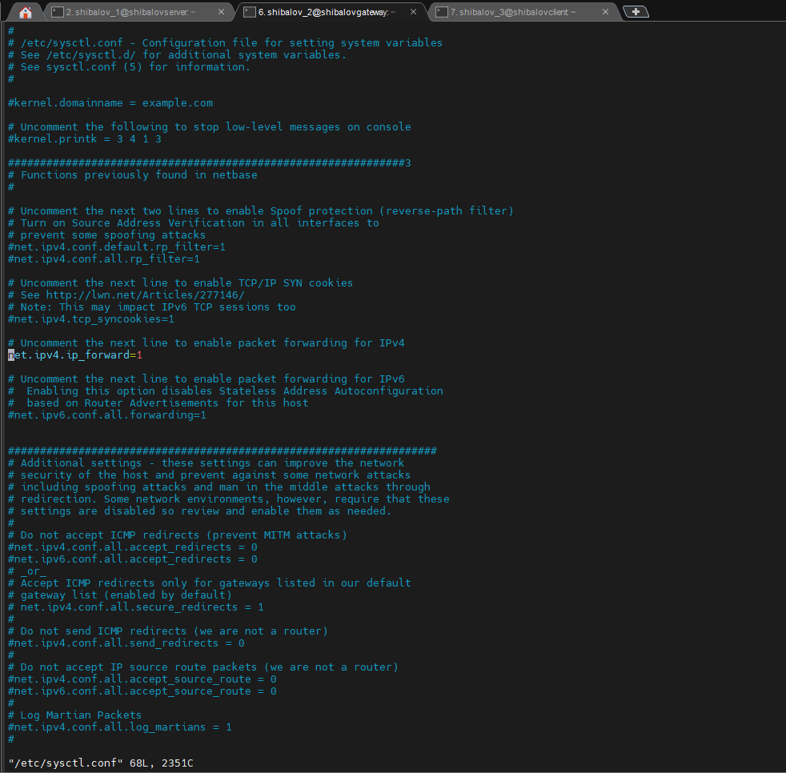

Результат ```tcpdump```:
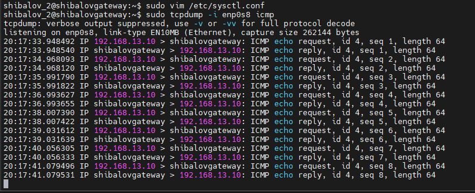

10. Пора установить Flask:

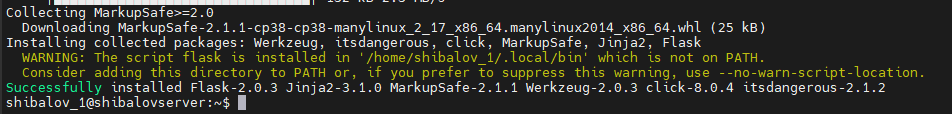

11. Создадим файл server.py со следующими конфигурациями сервера:

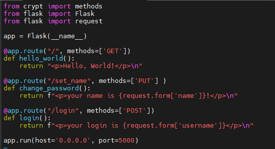

12. Создадим правила пересылки пакетов с ```iptables``` на шлюзе:

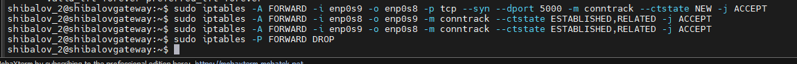

Откроем посмотреть правила:

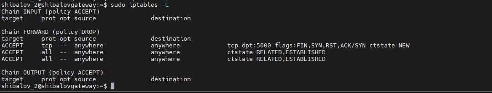

Сохраним правила:

```shell
$ sudo apt-get install iptables-persistent
```
```shell
$ sudo su
root# sudo iptables-save > /etc/iptables/rules.v4
root# sudo ip6tables-save > /etc/iptables/rules.v6
root# exit
```

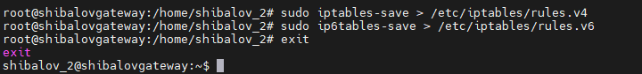

13. Запустим сервер Flask:

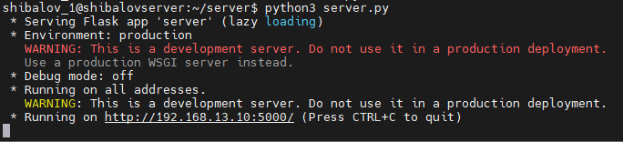

14. Настроим HTTP - сервер:

```shell
$ scp -P 1001 server.py shibalov_1@localhost:server.py
```
И службу ```web-server``` для автозапуска

```shell
$ sudo vim /lib/systemd/system/web-server.service
```

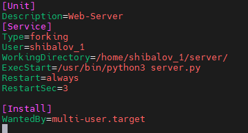

```
$ sudo systemctl daemon-reload
$ sudo systemctl start web-server
$ sudo systemctl enable web-server
$ sudo systemctl status web-server
```

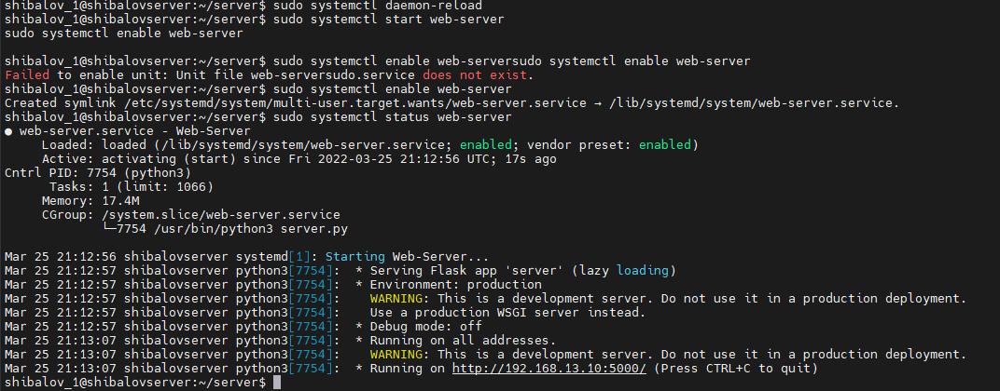

15. Создадим bash - скрипт для проверки сервера:

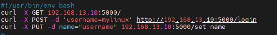

Будем им отправлять команды на сервер

16. Запустим скрипт с клиента:

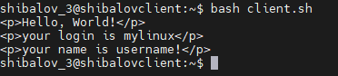

Отлично, ответ получен

17. Изменим на сервере порт с 5000 на 51000, запустим:

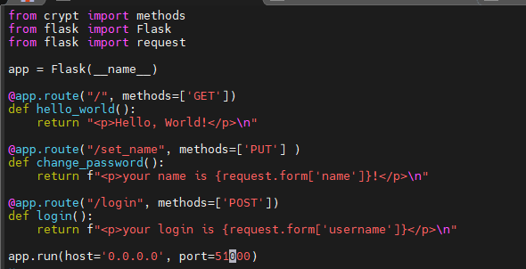

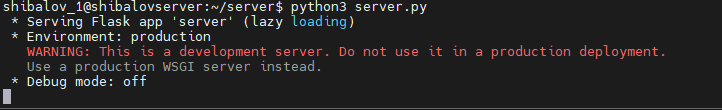

18. Проверим подключение к серверу:

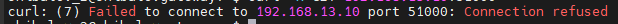

Не можем достучаться до сервера из-за разницы портов, что было очевидно.

# Вывод

Я настроил три виртуальные машины: сервер, клиент и шлюз, настроил конфигурацию сети, http- сервер и правила пропуска пакетов на шлюзе, в результате которого при обращении с клиентской виртуальной машины на развернутый на серверной виртуальной машине сервер через шлюз, клиент на свой запрос получил от сервера ответ от методов get, post и put, прописанных в конфигурации сервера Flask в файле server.py.